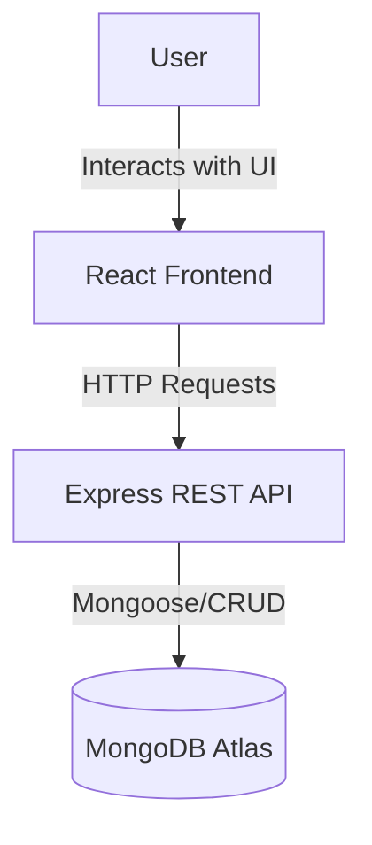
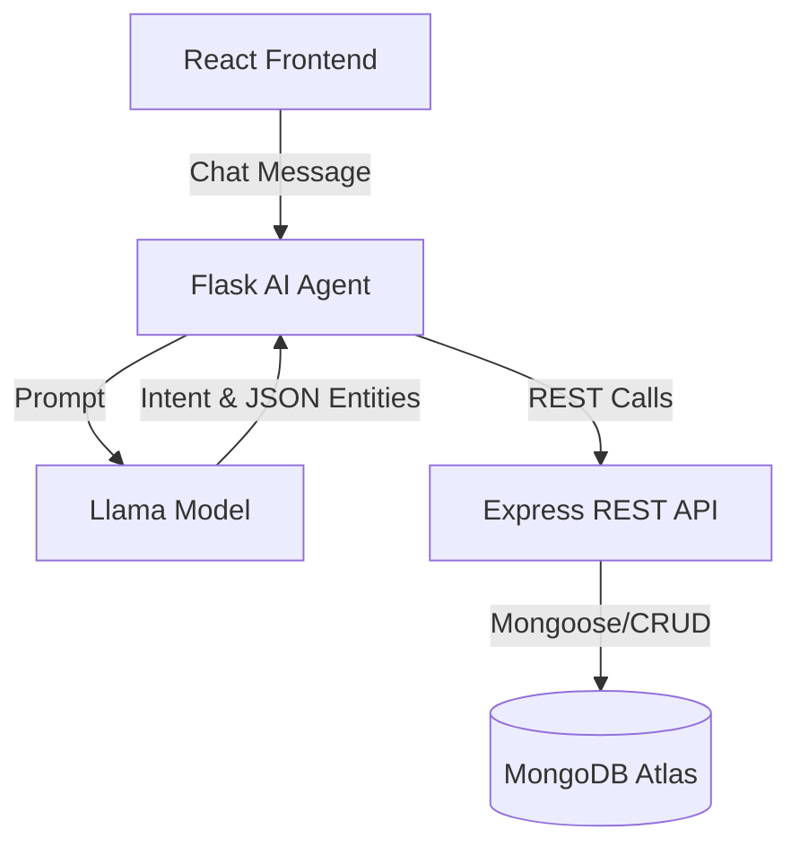
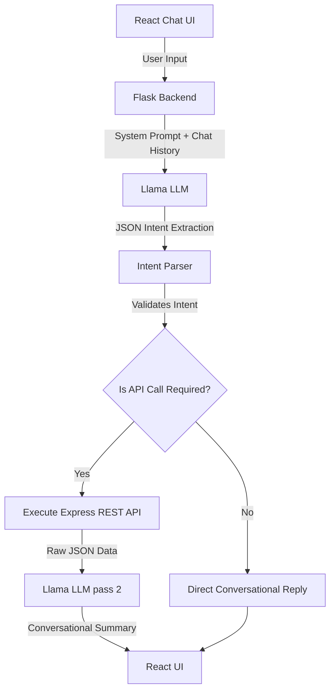

# 🎓 Intelligent Student Management System

> A complete, full-stack MERN application integrated with an AI-powered conversational assistant to manage student records via natural language.


---

## 🌐 Live Demo

- **Frontend Application:** [Deploy URL Here]
- **Backend API:** [Deploy URL Here]
- **AI Agent API:** [Deploy URL Here]
- **GitHub Repository:** [Repository URL Here]

---

## ✨ Features

The platform provides a modern, responsive interface and an intelligent backend to manage student data efficiently.

- **Student CRUD:** Complete Create, Read, Update, and Delete operations for student records.
- **Student Search:** Instantly search for students by Name or ID using a fast, optimized lookup.
- **Student Details:** View comprehensive information including age, detailed subject scores, and academic status.
- **Dynamic Academic Calculations:** The system automatically calculates Average score, Letter Grade (A-F), and Pass/Fail status.
- **Responsive Dashboard:** A beautiful, responsive layout optimized for mobile, tablet, and desktop viewing.
- **Statistics Cards:** Quick, at-a-glance metrics showing total students, top performers, and average performance.
- **Modern UI:** Built with sleek design principles, clean typography, and interactive hover states.
- **Real-time Updates:** The frontend state seamlessly syncs with backend changes without full page reloads.
- **REST API Integration:** A robust, standard RESTful Express backend to safely handle data transactions.
- **Conversational AI Assistant (Nova):** A smart chatbot that executes API operations based on natural language commands.
- **Toast Notifications:** Clean, non-intrusive alerts providing immediate feedback on user actions.
- **Form Validation:** Comprehensive client and server-side validation to ensure data integrity.
- **Error Handling:** Robust global error handling to elegantly manage network issues, missing data, and invalid inputs.

---

## 📸 Screenshots

| Dashboard | Add Student |
| :---: | :---: |
| *(Placeholder: Dashboard Screenshot)* | *(Placeholder: Add Student Screenshot)* |
| **Edit Student** | **AI Assistant** |
| *(Placeholder: Edit Student Screenshot)* | *(Placeholder: AI Assistant Screenshot)* |

*(Placeholder: Student Details Modal Screenshot)*

---

## 🏛️ Architecture Overview

The system follows a microservices-inspired architecture spanning three independent layers: the Client, the Core API, and the AI Agent.

### Core Application Architecture



### AI Agent Architecture



**Why this architecture?**
Separating the backend REST API (Node.js) from the AI Orchestrator (Python Flask) allows each service to do what it does best. Node.js handles high-concurrency CRUD operations perfectly, while Python provides the richest ecosystem for AI SDKs, prompt engineering, and LLM orchestration. 

---

## 🛠️ Technology Stack

| Layer | Technologies |
| :--- | :--- |
| **Frontend** | React, CSS3, Lucide React (Icons), React Hot Toast |
| **Backend** | Node.js, Express.js |
| **Database** | MongoDB Atlas, Mongoose ODM |
| **AI Layer** | Python, Flask, Groq API (Llama 3.3) |
| **Deployment** | Render |
| **Other Libraries**| dotenv, flask-cors, concurrently (Monorepo setup) |

---

## 📁 Project Structure

```text
turnipseed-task/
├── frontend/             # React SPA (User Interface)
├── backend/              # Node.js + Express (REST API)
├── python-agent/         # Flask API (AI Orchestrator)
├── package.json          # Root orchestration (concurrently)
└── README.md             # Project documentation
```

- **`frontend/`**: Handles the visual presentation, user inputs, and communication with the Backend and AI Agent.
- **`backend/`**: Serves as the source of truth, validating data, performing academic calculations, and interfacing with MongoDB.
- **`python-agent/`**: Houses "Nova", the AI orchestrator that translates natural language into actionable REST API calls.

---

## 🔄 User Flow

1. **User opens dashboard**: The React application mounts and initializes.
2. **Dashboard loads statistics**: The frontend requests aggregated data to display high-level metrics.
3. **Student list fetched**: A `GET /students` request fetches the current roster from MongoDB.
4. **Search / Filter**: Users can instantly filter the roster locally or via the backend.
5. **Add Student**: User fills out the modal form.
6. **Backend validation**: Express validates the incoming payload (checking age ranges, score limits, required fields).
7. **MongoDB**: The valid document is saved to the cluster.
8. **Dashboard updates**: The frontend pushes the new student to local state, avoiding a full page reload.
9. **Toast notification**: A success message briefly appears on the screen.
10. **AI Assistant**: The user opens the chat widget and types: *"Add John, age 20, Math 95"*.
11. **Natural language**: The message is sent to the Flask Agent.
12. **Intent extraction**: The LLM extracts the intent (`ADD_STUDENT`) and structures the data into JSON.
13. **REST API**: The Flask app automatically makes the POST request to the Express backend.
14. **MongoDB**: Data is saved.
15. **Response**: The LLM translates the raw JSON success response into conversational text, and the UI dynamically refreshes.

---

## 💻 MERN Features Implementation

- **Student CRUD**: Handled via standard HTTP methods (GET, POST, PUT, DELETE) on the Express router.
- **Search**: Implemented using a combination of local state filtering and backend query string matching.
- **Statistics Dashboard**: Dynamically reduces state arrays to compute averages, top scores, and total counts.
- **Average Calculation**: Backend middleware calculates the mean of all subject scores before saving to the DB.
- **Grade Calculation**: A switch-case logic block assigns A, B, C, D, or F based on the computed average.
- **Pass/Fail Logic**: A boolean flag (`isPass`) is set to true if the average is >= 40.
- **Responsive UI**: Custom CSS media queries ensure the grid layout collapses elegantly on smaller screens.
- **Modern Component Design**: Modularized React components (`StudentModal`, `ChatWidget`, `StatCard`).
- **API Integration**: Abstracted `api.js` service file to handle all `fetch`/`axios` calls cleanly.
- **State Management**: Handled via React Hooks (`useState`, `useEffect`) avoiding overly complex Redux boilerplate for a targeted app.
- **Loading States**: Skeletons and spinners provide immediate feedback during async operations.
- **Toast Notifications**: Integrated `react-hot-toast` for global success/error messaging.
- **Delete Confirmation**: UI safeguards to prevent accidental data loss.

---

## ✅ Form Validation

Validation is implemented strictly on both the Client (for UX) and the Server (for security).

- **Student ID Uniqueness**: The backend checks MongoDB for existing IDs before insertion.
- **Required Fields**: Name, Age, and at least one subject are strictly required.
- **Proper Name Capitalization**: Sanitization ensures names are formatted cleanly.
- **Age Validation**: Rejects unrealistic age inputs (e.g., negative numbers).
- **Score Validation**: Subject scores are clamped between `0` and `100`.
- **Subject Validation**: Prevents empty subject names.
- **Duplicate Prevention**: Handles MongoDB `E11000` duplicate key errors gracefully.
- **Whitespace Trimming**: Eliminates accidental spaces before DB insertion.
- **Empty Input Handling**: Disables submit buttons until forms are valid.
- **Invalid Input Handling**: Returns `400 Bad Request` with specific error arrays.
- **User-friendly Validation Messages**: Translates raw server errors into readable toast notifications.

---

## 🧮 Academic Calculation Logic

When a student record is created or updated, the backend calculates the following before saving:

1. **Average**: 
   `Average = SUM(all subject scores) / COUNT(subjects)`
2. **Grade**: 
   - `A`: >= 90
   - `B`: >= 80
   - `C`: >= 70
   - `D`: >= 60
   - `F`: < 60
3. **Pass/Fail**: 
   - `Passed`: Average >= 40
   - `Failed`: Average < 40

---

## 📖 REST API Documentation

### `POST /students`
**Purpose:** Creates a new student record.
- **Request:** JSON object containing `studentId`, `name`, `age`, `subjects`.
- **Response:** The created student object including auto-calculated fields.
- **Status Codes:** `201 Created`, `400 Bad Request`, `409 Conflict`.

### `GET /students`
**Purpose:** Retrieves all student records.
- **Request:** Optional `?search=query` parameter.
- **Response:** Array of student objects.
- **Status Codes:** `200 OK`.

### `GET /students/:id`
**Purpose:** Retrieves a single student by ID.
- **Response:** Single student object.
- **Status Codes:** `200 OK`, `404 Not Found`.

### `PUT /students/:id`
**Purpose:** Updates an existing student record.
- **Request:** JSON object with updated fields.
- **Response:** The updated student object.
- **Status Codes:** `200 OK`, `400 Bad Request`, `404 Not Found`.

### `DELETE /students/:id`
**Purpose:** Removes a student from the database.
- **Response:** Success message.
- **Status Codes:** `200 OK`, `404 Not Found`.

---

## 🤖 AI Assistant (Nova)

Nova is an AI-powered conversational assistant designed specifically for this Student Management System. 

Instead of forcing users to click through forms, Nova understands natural language. Nova acts as a powerful orchestrator: she interprets user requests, maps them to the correct backend REST API calls, executes them securely, and translates the raw JSON results back into friendly, conversational English.

Nova is fully capable of:
- **Adding Students:** "Add Rahul, age 20, Math 95"
- **Updating Students:** "Update Adam's marks to 100 in Physics"
- **Deleting Students:** "Delete STU002"
- **Searching Students:** "How is STU001 doing?"
- **Listing Students:** "How many students are there?"

---

## 🧠 AI Architecture



---

## 🗣️ Conversational Memory

To make the AI feel natural and human, **Conversational Memory** was implemented. 

The frontend maintains a rolling window of the previous five user-assistant messages and passes them to the Flask backend. This dramatically improves:
- **Context:** The AI knows who "he" or "she" is based on previous messages.
- **Natural Conversation:** Users don't have to repeat themselves.
- **Follow-up Queries:** Users can ask "What is his grade?" immediately after searching for a student.
- **Conversation Continuity:** Ensures a seamless conversational flow rather than isolated robotic commands.

---

## 🔄 Two-Pass Prompt Engineering Strategy

Nova operates using a highly reliable **Two-Pass Prompt Engineering Strategy** to separate reasoning from response generation.

### Pass 1: Intent Detection
The LLM acts purely as a data-extraction machine. It takes the natural language and extracts the **Intent** (e.g., `ADD_STUDENT`) and the **Entities** (Name, Age, Scores). It also validates missing information (e.g., if the user didn't provide scores, the LLM requests them instead of failing).

### Pass 2: Natural Summarization
Once the Python backend executes the API call (e.g., POST to Express), it receives raw JSON back from the database. The LLM is invoked a *second* time. It is fed the raw JSON and instructed to summarize the outcome conversationally (e.g., "✅ Rahul was successfully added with an A grade!").

**Why this improves the AI:**
- **Reliability & Accuracy:** The AI is never guessing data; it only summarizes factual JSON data returned directly from the database.
- **Reduced Hallucinations:** Prevents the AI from hallucinating a successful database operation if the API actually failed.
- **Consistent API Interaction:** Separating the rigid JSON extraction from the creative text generation yields far more stable API integrations.

---

## 🦙 Why Llama Instead of Gemini

The original project specification requested the integration of Google Gemini. 

However, during the implementation phase, Gemini's free-tier API quotas proved too restrictive for the rigorous, repetitive testing required to refine the two-pass prompt engineering flow. 

To ensure a highly reliable demonstration environment for reviewers, **an open-source Llama 3.3 model (via Groq)** was integrated instead. 

It is crucial to note that **the overall architecture, prompt engineering techniques, intent extraction logic, REST API interactions, and AI workflow remain exactly the same.** Only the underlying API endpoint and API key were swapped.

---

## 🛡️ Error Handling

The application features robust error boundaries at every layer:

- **Invalid Student ID:** Returns a friendly 404/400 and informs the user.
- **Duplicate IDs:** MongoDB `E11000` errors are caught by Express and returned as clean `409 Conflict` errors to the UI.
- **Student Not Found:** The AI gracefully handles empty arrays and informs the user.
- **API Failure:** Global `.catch()` blocks in React trigger red toast notifications.
- **Database / Network Errors:** The Flask Agent informs the user if the Node.js backend goes offline.
- **Missing Fields / Invalid Scores:** Handled by both UI required attributes and Express validation middlewares.
- **AI Parsing Failure:** If the LLM generates malformed JSON, the Python orchestrator gracefully falls back to a friendly error message instead of crashing.

---

## 🚀 Deployment

The entire stack is deployed seamlessly on **Render**:

- **Frontend:** Hosted as a static site build.
- **Express Backend:** Hosted as a Node.js Web Service.
- **Python AI Agent:** Hosted as a Python Web Service via Gunicorn.
- **Database:** Hosted on MongoDB Atlas cluster.

All services communicate securely using Environment Variables configuration.

---

## 💻 Running the Project Locally

To dramatically simplify the developer experience, the project utilizes a root `package.json` with the `concurrently` package.

You only need two commands to start the entire MERN stack + Python AI Agent!

1. Install dependencies across all folders:
   ```bash
   npm install
   ```

2. Start the application:
   ```bash
   npm run start
   ```

This single command simultaneously boots the React Frontend (Vite), the Express Backend (Node), and the Flask AI Agent (Python/venv).

---

## 🔐 Environment Variables

You will need to set up `.env` files in the respective directories:

### `backend/.env`
```env
PORT=5001
MONGO_URI=mongodb+srv://<username>:<password>@cluster.mongodb.net/school
```

### `python-agent/.env`
```env
GROQ_API_KEY=gsk_your_groq_api_key_here
API_BASE_URL=http://localhost:5001/students
```

*(No `.env` is required for the frontend out of the box as it proxies to localhost in development).*

---

## 💬 Example AI Prompts

Try these prompts in the Nova Chat Widget!

**Add Student**
- "Add a new student named Sarah, she is 19. She scored 95 in Physics and 88 in Math."
- "Register student Mark. Age 21. History 70, English 75."

**Update Student**
- "Update Adam's marks to 100 in Physics."
- "Change STU001's age to 21."
- "Set Rahul's History score to 80."

**Delete Student**
- "Delete student STU002."
- "Remove Helen from the system."
- "Can you delete STU005?"

**Search & List**
- "Show me STU001."
- "How is Adam doing?"
- "How many students are there?"
- "List all students."
- "Show me all the students in the database."

**Conversational & Edge Cases**
- "Hi Nova!"
- "Delete the student." *(Nova will ask which one)*
- "Add a student." *(Nova will ask for missing details)*
- "Delete me." *(Nova will push back playfully)*
- "What's the weather?" *(Nova will explain her scope)*

---

## 🔮 Future Improvements

While this system is production-ready for the assignment requirements, future enterprise enhancements could include:
- **Authentication & Authorization (JWT):** Securing the dashboard and API endpoints with role-based access (Admin vs Teacher).
- **Pagination:** Essential for scaling the `GET /students` endpoint to thousands of records.
- **Advanced Analytics:** Chart.js integration for visual performance grading over time.
- **Export/Import:** Generating CSV/PDF reports and bulk-importing students.
- **Voice Commands:** Integrating Web Speech API so users can literally talk to Nova.

---

## 🧗 Challenges Faced

- **AI Formatting Stability:** Coaxing the LLM to consistently output raw JSON without markdown code blocks required strict prompt engineering and backup regex sanitization.
- **Context Bleed:** Preventing the AI from accidentally carrying over a previously viewed Student ID into a highly destructive `DELETE` command required explicit negative constraints in the System Prompt.
- **Monorepo Startup:** Configuring `concurrently` to cleanly boot a Node environment alongside a Python virtual environment across multiple operating systems.

---

## 📚 Key Learning Outcomes

- Architecting decoupled microservices (React UI + Node REST API + Python AI Orchestrator).
- Designing robust Mongoose schemas with pre-save hooks for academic calculations.
- Integrating modern LLMs into traditional web stacks.
- Utilizing **Prompt Engineering** to build reliable, stateful software systems rather than just chatbots.
- Implementing effective cross-service error handling and UI/UX state management.

---

## 🎯 Conclusion

This project successfully demonstrates modern full-stack software engineering. It bridges the gap between traditional robust CRUD architectures (MERN) and next-generation AI integrations. By enforcing strict separation of concerns, comprehensive validation, and a highly polished user experience, this application serves as a strong foundation for a production-oriented student management system.
