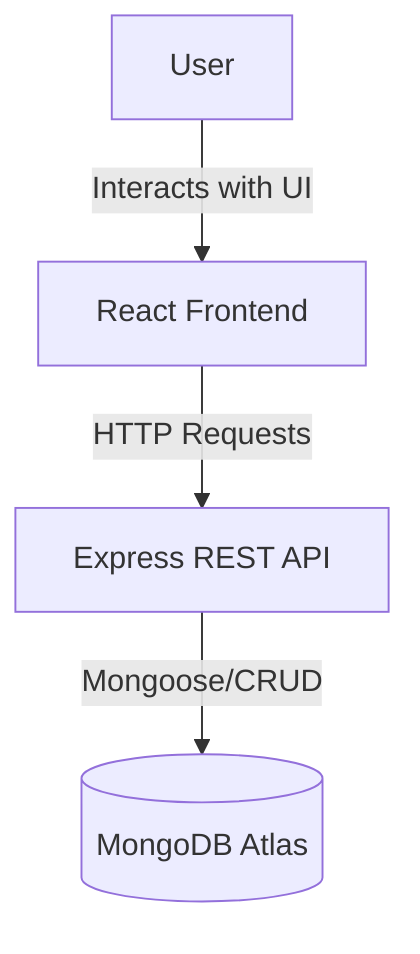
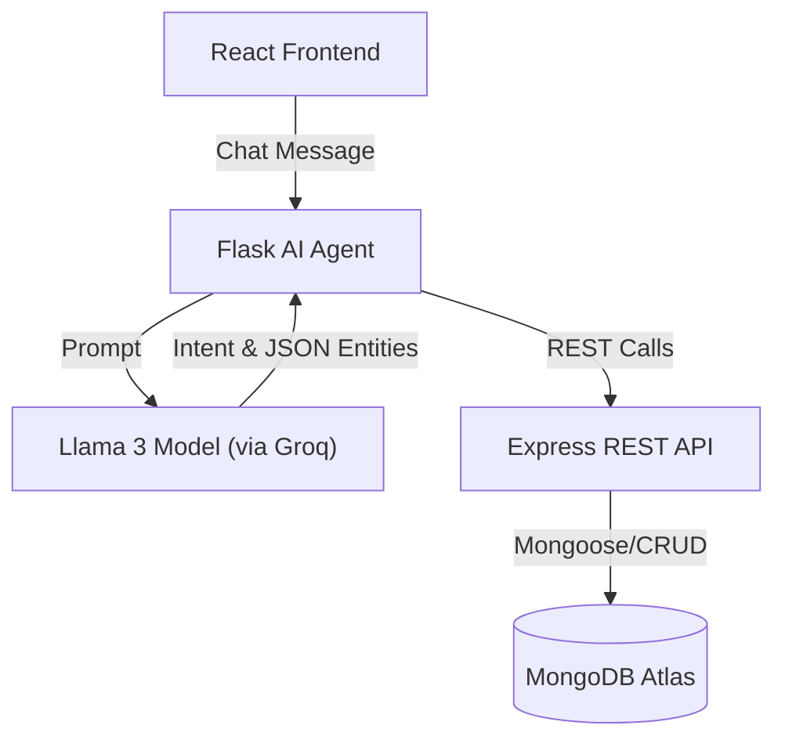
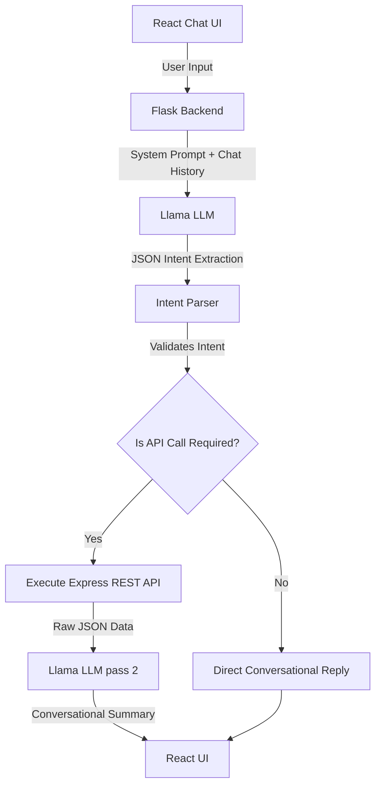

# Intelligent Student Management System

> A complete, full-stack MERN application integrated with an AI-powered conversational assistant to manage student records via natural language.


---

## Reviewer Note

The live demo showcases the complete frontend, backend, authentication, and MongoDB integration.


### Demo Credentials
Username: admin
Password: admin123

> **AI Assistant**
>
> The AI service relies on free-tier LLM providers. These providers may restrict requests originating from cloud-hosted environments (such as Render), making the hosted AI demo occasionally unavailable.
>
> To evaluate the complete AI functionality, clone the repository, add a valid Groq API key, and run the project locally using the setup instructions below.

---

## Assignment Checklist

- [x] MERN Stack Application
- [x] RESTful API
- [x] MongoDB Integration
- [x] Responsive UI
- [x] CRUD Operations
- [x] AI-powered Natural Language Interface
- [x] Deployed Frontend
- [x] Deployed Backend
- [x] Source Code with Documentation

---

## Live Demo

- **Frontend Application:** https://student-frontend-ixu5.onrender.com/
- **Backend API:**  https://student-management-portal-53js.onrender.com
- **AI Agent API:**  https://student-ai-agent-5cwh.onrender.com

The deployed application demonstrates the complete MERN architecture. If the AI assistant is temporarily unavailable due to free-tier provider restrictions, all remaining application features can still be fully evaluated through the live demo.

---

## Features

The platform provides a modern, responsive interface and an intelligent backend to manage student data efficiently.

- **Student CRUD:** Complete Create, Read, Update, and Delete operations for student records.
- **Student Search:** Instantly search for students by Name or ID using a fast, optimized lookup.
- **Student Details:** View comprehensive information including age, detailed subject scores, and academic status.
- **Dynamic Academic Calculations:** The system automatically calculates Average score, Letter Grade (A-F), and Pass/Fail status.
- **Responsive Dashboard:** A beautiful, responsive layout optimized for mobile, tablet, and desktop viewing.
- **Statistics Cards:** Quick, at-a-glance metrics showing total students, top performers, and average performance.
- **Modern UI:** Built with sleek design principles, clean typography, and interactive hover states.
- **Real-time Updates:** The frontend state seamlessly syncs with backend changes without full page reloads.
- **REST API Integration:** A robust, standard RESTful Express backend to safely handle data transactions.
- **Conversational AI Assistant (Nova):** A smart chatbot that executes API operations based on natural language commands.
- **Toast Notifications:** Clean, non-intrusive alerts providing immediate feedback on user actions.
- **Form Validation:** Comprehensive client and server-side validation to ensure data integrity.
- **Error Handling:** Robust global error handling to elegantly manage network issues, missing data, and invalid inputs.

---

## Screenshots

| Dashboard | Add Student |
| :---: | :---: |
| 
 | 
 |
| **Edit Student** | **AI Assistant** |
| 
 | 
|

*(Placeholder: Student Details Modal Screenshot)*

---

## Architecture Overview

The system follows a microservices-inspired architecture spanning three independent layers: the Client, the Core API, and the AI Agent.

### Core Application Architecture



### AI Agent Architecture



**Why this architecture?**
Separating the backend REST API (Node.js) from the AI Orchestrator (Python Flask) allows each service to do what it does best. Node.js handles high-concurrency CRUD operations perfectly, while Python provides the richest ecosystem for AI SDKs, prompt engineering, and LLM orchestration. 

---

## Technology Stack

| Layer | Technologies |
| :--- | :--- |
| **Frontend** | React, CSS3, Lucide React (Icons), React Hot Toast |
| **Backend** | Node.js, Express.js |
| **Database** | MongoDB Atlas, Mongoose ODM |
| **AI Layer** | Python, Flask, Groq API (Llama 3.3) |
| **Deployment** | Render |
| **Other Libraries**| dotenv, flask-cors, concurrently (Monorepo setup) |

---

## Project Structure

```text
turnipseed-task/
├── frontend/             # React SPA (User Interface)
├── backend/              # Node.js + Express (REST API)
├── python-agent/         # Flask API (AI Orchestrator)
├── package.json          # Root orchestration (concurrently)
└── README.md             # Project documentation
```

- **`frontend/`**: Handles the visual presentation, user inputs, and communication with the Backend and AI Agent.
- **`backend/`**: Serves as the source of truth, validating data, performing academic calculations, and interfacing with MongoDB.
- **`python-agent/`**: Houses "Nova", the AI orchestrator that translates natural language into actionable REST API calls.

---

## User Flow

1. The React frontend loads the dashboard and fetches student data from the Express API.
2. Users can search, add, update, or delete student records through the UI.
3. The Express backend validates all incoming data and performs academic calculations (average, grade, pass/fail).
4. Valid records are stored in MongoDB Atlas.
5. The frontend updates automatically and displays success/error notifications.
6. For AI interactions, the user's message is sent to the Flask AI Agent.
7. The LLM extracts the user's intent, invokes the appropriate REST API, and retrieves the result.
8. The AI converts the API response into a conversational reply, and the UI refreshes accordingly.

---

## MERN Features Implementation

- RESTful CRUD operations implemented using Express routes.
- Dynamic search using backend queries and client-side filtering.
- Automatic academic calculations (average, grade, pass/fail) performed on the backend.
- Responsive React UI built with reusable components.
- React Hooks (`useState`, `useEffect`) for state management.
- Centralized API integration through a dedicated service layer.
- Loading indicators, toast notifications, and delete confirmations for improved UX.

---

## Form Validation

Validation is implemented on both the client (UX) and server (security).

- Required field validation for student details.
- Unique Student ID verification.
- Age and score range validation.
- Subject and input sanitization (trimming, capitalization).
- Duplicate record prevention (`E11000` handling).
- User-friendly validation and error messages.

---

## Academic Calculation Logic

When a student record is created or updated, the backend calculates the following before saving:

1. **Average**: 
   `Average = SUM(all subject scores) / COUNT(subjects)`
2. **Grade**: 
   - `A`: >= 90
   - `B`: >= 80
   - `C`: >= 70
   - `D`: >= 60
   - `F`: < 60
3. **Pass/Fail**: 
   - `Passed`: Average >= 40
   - `Failed`: Average < 40

---

## REST API Documentation

### `POST /students`
**Purpose:** Creates a new student record.
- **Request:** JSON object containing `studentId`, `name`, `age`, `subjects`.
- **Response:** The created student object including auto-calculated fields.
- **Status Codes:** `201 Created`, `400 Bad Request`, `409 Conflict`.

### `GET /students`
**Purpose:** Retrieves all student records.
- **Request:** Optional `?search=query` parameter.
- **Response:** Array of student objects.
- **Status Codes:** `200 OK`.

### `GET /students/:id`
**Purpose:** Retrieves a single student by ID.
- **Response:** Single student object.
- **Status Codes:** `200 OK`, `404 Not Found`.

### `PUT /students/:id`
**Purpose:** Updates an existing student record.
- **Request:** JSON object with updated fields.
- **Response:** The updated student object.
- **Status Codes:** `200 OK`, `400 Bad Request`, `404 Not Found`.

### `DELETE /students/:id`
**Purpose:** Removes a student from the database.
- **Response:** Success message.
- **Status Codes:** `200 OK`, `404 Not Found`.

---

## AI Assistant (Nova)

Nova is an AI-powered conversational assistant designed specifically for this Student Management System. 

Instead of forcing users to click through forms, Nova understands natural language. Nova acts as a powerful orchestrator: she interprets user requests, maps them to the correct backend REST API calls, executes them securely, and translates the raw JSON results back into friendly, conversational English.

Supported operations include:
- **Adding Students:** "Add Rahul, age 20, Math 95"
- **Updating Students:** "Update Adam's marks to 100 in Physics"
- **Deleting Students:** "Delete STU002"
- **Searching Students:** "How is STU001 doing?"
- **Listing Students:** "How many students are there?"

---

## AI Architecture



---

## Conversational Memory

To make the AI feel natural and human, **Conversational Memory** was implemented. 

The frontend maintains a rolling window of the previous five user-assistant messages and passes them to the Flask backend. This dramatically improves:
- **Context:** The AI knows who "he" or "she" is based on previous messages.
- **Natural Conversation:** Users don't have to repeat themselves.
- **Follow-up Queries:** Users can ask "What is his grade?" immediately after searching for a student.
- **Conversation Continuity:** Ensures a seamless conversational flow rather than isolated robotic commands.

---

## Two-Pass Prompt Engineering Strategy

Nova operates using a highly reliable **Two-Pass Prompt Engineering Strategy** to separate reasoning from response generation.

### Pass 1: Intent Detection
The LLM acts purely as a data-extraction machine. It takes the natural language and extracts the **Intent** (e.g., `ADD_STUDENT`) and the **Entities** (Name, Age, Scores). It also validates missing information (e.g., if the user didn't provide scores, the LLM requests them instead of failing).

### Pass 2: Natural Summarization
Once the Python backend executes the API call (e.g., POST to Express), it receives raw JSON back from the database. The LLM is invoked a *second* time. It is fed the raw JSON and instructed to summarize the outcome conversationally (e.g., "Rahul was successfully added with an A grade!").

**Why this improves the AI:**
- **Reliability & Accuracy:** The AI is never guessing data; it only summarizes factual JSON data returned directly from the database.
- **Reduced Hallucinations:** Prevents the AI from hallucinating a successful database operation if the API actually failed.
- **Consistent API Interaction:** Separating the rigid JSON extraction from the creative text generation yields far more stable API integrations.

---

## Error Handling

The application features robust error boundaries at every layer:

- **Rate Limiting:** The AI endpoint is rate-limited (10 requests per 5 minutes) to prevent free-tier quota exhaustion.
- **Invalid Student ID:** Returns a friendly 404/400 and informs the user.
- **Duplicate IDs:** MongoDB `E11000` errors are caught by Express and returned as clean `409 Conflict` errors to the UI.
- **Student Not Found:** The AI gracefully handles empty arrays and informs the user.
- **API Failure:** Global `.catch()` blocks in React trigger red toast notifications.
- **Database / Network Errors:** The Flask Agent informs the user if the Node.js backend goes offline.
- **Missing Fields / Invalid Scores:** Handled by both UI required attributes and Express validation middlewares.
- **AI Parsing Failure:** If the LLM generates malformed JSON, the Python orchestrator gracefully falls back to a friendly error message instead of crashing.

---

## Deployment

The application is deployed using Render services:

- **Frontend:** Hosted as a static site build.
- **Express Backend:** Hosted as a Node.js Web Service.
- **Python AI Agent:** Hosted as a Python Web Service via Gunicorn.
- **Database:** Hosted on MongoDB Atlas cluster.

All services communicate securely using Environment Variables configuration.

---

## Running the Project Locally

The project uses a root package.json with concurrently to start all services together.

Before starting the application, configure the required environment variables in backend/.env and python-agent/.env.

Install dependencies and start all services:

```bash
npm install
npm run start
```

This single command simultaneously boots the React Frontend (Vite), the Express Backend (Node), and the Flask AI Agent (Python/venv).

---

## Environment Variables

You will need to set up `.env` files in the respective directories:

### `backend/.env`
```env
PORT=5001
MONGO_URI=mongodb+srv://<username>:<password>@cluster.mongodb.net/school
```

### `python-agent/.env`
```env
GROQ_API_KEY=gsk_your_groq_api_key_here

API_BASE_URL=http://localhost:5001/students
```


*(No `.env` is required for the frontend out of the box as it proxies to localhost in development).*

---

## Example AI Prompts

Try these 10 example prompts in the Nova Chat Widget!

1. "Add a new student named Sarah, she is 19. She scored 95 in Physics and 88 in Math."
2. "Register student Mark. Age 21. History 70, English 75."
3. "Update Adam's marks to 100 in Physics."
4. "Change STU001's age to 21."
5. "Set Rahul's History score to 80."
6. "Delete student STU002."
7. "Remove Helen from the system."
8. "Show me STU001."
9. "How is Adam doing?"
10. "How many students are there?"

---

## Future Improvements

While the application satisfies the assignment requirements, future enhancements could include:
- Replace free-tier LLM inference with a production-grade hosted model for higher reliability and throughput.
- **Authentication & Authorization (JWT):** Securing the dashboard and API endpoints with role-based access (Admin vs Teacher).
- **Pagination:** Essential for scaling the `GET /students` endpoint to thousands of records.
- **Advanced Analytics:** Chart.js integration for visual performance grading over time.
- **Export/Import:** Generating CSV/PDF reports and bulk-importing students.
- **Voice Commands:** Integrating Web Speech API so users can literally talk to Nova.

---

## Challenges Faced

- **AI Formatting Stability:** Coaxing the LLM to consistently output raw JSON without markdown code blocks required strict prompt engineering and backup regex sanitization.
- **Context Bleed:** Preventing the AI from accidentally carrying over a previously viewed Student ID into a highly destructive `DELETE` command required explicit negative constraints in the System Prompt.
- **Monorepo Startup:** Configuring `concurrently` to cleanly boot a Node environment alongside a Python virtual environment across multiple operating systems.

---

## Key Learning Outcomes

- Architecting decoupled microservices (React UI + Node REST API + Python AI Orchestrator).
- Designing robust Mongoose schemas with pre-save hooks for academic calculations.
- Integrating modern LLMs into traditional web stacks.
- Utilizing **Prompt Engineering** to build reliable, stateful software systems rather than just chatbots.
- Implementing effective cross-service error handling and UI/UX state management.

---

## Conclusion

This project successfully demonstrates modern full-stack software engineering. It bridges the gap between traditional robust CRUD architectures (MERN) and next-generation AI integrations. By enforcing strict separation of concerns, comprehensive validation, and a highly polished user experience, this application serves as a strong foundation for a production-oriented student management system.
